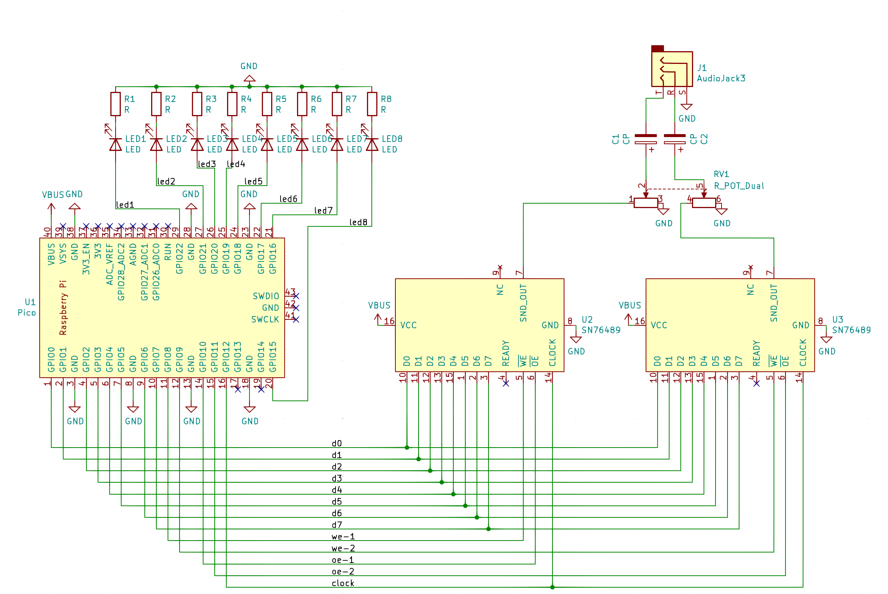

# pico-player
Music player for Raspberry Pi Pico and a pair of SN76489s


## Installation
 * Copy the contents of `firmware` (`sound.py` and `music_player.py` to your Pico), via `rshell cp firmware/* /pyboard` or pasting into Thonny, etc.
 
## Playing songs from the Pico's file system
 * On your computer, run `python3 util/convert_midi.py example.mid example.dat`
 * Copy the output to the Pico via e.g. `rshell cp example.dat /pyboard`. It is a binary file so pasting it via an IDE isn't going to work.
 * On the Pico, instantiate a MusicPlayer and play the song:
```
from music_player import MusicPlayer
mp = MusicPlayer()
mp.play_song('example.dat')
```
## Playing MIDI files from a connected computer
 * run `python3 util/convert_midi.py example.mid -` 

## How it works
 * A (very) short PIO program clocks both sound chips. This could also be done with PWM, but the fractional multiplier on the Pico's PIO controller gives us a lot of flexibility on what frequency to clock the chips at, and since the chip has only a 10-bit frequency register, there are tradeoffs between clock rate and usable note range.
 * Another short PIO program sends data to both chips. It just tosses 10 bits at the first ten GPIOs, where the first eight go to both chips' data lines, and the last two go to each chip's Write Enable line. By setting exactly one of those bits, I control which sound chip latches the value. The PIO program then waits the requisite 32 cycles for the SN76489 to complete the I/O, while the main Python program keeps running! It just tosses a value in the FIFO and forgets. It's magic.
 * A timer callback fires every 50ms and manages the sound envelope for each playing note, and also updates the brightness of each LED.
 * The LEDs are managed with PWM. The Pico has *sixteen* PWM channels and they work with *any* of the GPIOs. It's magic.
 
## The hard part
Getting music data into a usable format is tricky. I wrote a script (util/convert_midi.py) that translates note-on and note-off events into a simple binary format that the microcontroller program can parse and play. The primary challenge is that we have only six notes of polyphony to work with, so it works best with simple MIDI files. I suggest opening files in e.g. MuseScore beforehand to identify channels to prioritize (with -p) or exclude (with -x). If no arguments are given, convert_midi.py will prioritize channels in tracks named "melody" or "vocals".
 
## Bill of Materials
 * one Raspberry Pi Pico
 * two SN76489 sound chips
 * two 10uF electrolytic capacitors (the value isn't critical)
 * one stereo 3.5mm audio jack (CUI SJ1-3533NG)
 * (optionally) one dual-gang 10k potentiometer for volume control (Alps RK09L)
 
## Wiring (see KiCad schematic in hardware/pico-player-pcb)

 * VBUS to both chips' VCC (pin 16)
 * GND to both chips' GND (pin 8)
 * GPIOs 0..7 to the data lines of both sound chips in parallel (GPIO 0 to pin 10)
 * GPIO 8 to the left chip's /WE line (pin 5)
 * GPIO 9 to the right chip's /WE line
 * GPIO 10 to the left chip's /OE line (pin 6)
 * GPIO 11 to the right chip's /OE line
 * GPIO 12 to both chips' clock (pin 14)
 * Both sound chips' READY disconnected (it's 5V logic anyway)
 * GPIOs 15..22 to the blinkenlights!
